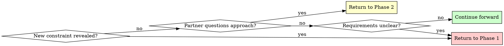

# Brainstorming Ideas Into Designs

## Overview

Transform rough ideas into fully-formed designs through structured questioning and alternative exploration.

**Core principle:** Ask questions to understand, explore alternatives, present design incrementally for validation.

**Announce at start:** "I'm using the brainstorming skill to refine your idea into a design."

## Quick Reference

| Phase | Key Activities | Output |
|-------|---------------|--------|
| **1. Understanding** | Ask questions (one at a time) | Purpose, constraints, criteria |
| **2. Exploration** | Propose 2-3 approaches | Architecture options with trade-offs |
| **3. Design Presentation** | Present in 200-300 word sections | Complete design with validation |
| **4. Worktree Setup** | Set up isolated workspace | Ready development environment |
| **5. Planning Handoff** | Create implementation plan | Detailed task breakdown |

## The Process

Copy this checklist to track progress:

```
Brainstorming Progress:
- [ ] Phase 1: Understanding (purpose, constraints, criteria gathered)
- [ ] Phase 2: Exploration (2-3 approaches proposed and evaluated)
- [ ] Phase 3: Design Presentation (design validated in sections)
- [ ] Phase 4: Worktree Setup (if implementing)
- [ ] Phase 5: Planning Handoff (if implementing)
```

### Phase 1: Understanding
- Check current project state in working directory
- Ask ONE question at a time to refine the idea
- Prefer multiple choice when possible
- Gather: Purpose, constraints, success criteria

### Phase 2: Exploration
- Propose 2-3 different approaches
- For each: Core architecture, trade-offs, complexity assessment
- Ask your human partner which approach resonates

### Phase 3: Design Presentation
- Present in 200-300 word sections
- Cover: Architecture, components, data flow, error handling, testing
- Ask after each section: "Does this look right so far?"

### Phase 4: Worktree Setup (for implementation)
When design is approved and implementation will follow:
- Announce: "I'm using the using-git-worktrees skill to set up an isolated workspace."
- Switch to skills/collaboration/using-git-worktrees
- Follow that skill's process for directory selection, safety verification, and setup
- Return here when worktree ready

### Phase 5: Planning Handoff
Ask: "Ready to create the implementation plan?"

When your human partner confirms (any affirmative response):
- Announce: "I'm using the writing-plans skill to create the implementation plan."
- Switch to skills/collaboration/writing-plans skill
- Create detailed plan in the worktree

## When to Revisit Earlier Phases



**You can and should go backward when:**
- Partner reveals new constraint during Phase 2 or 3 → Return to Phase 1
- Validation shows fundamental gap in requirements → Return to Phase 1
- Partner questions approach during Phase 3 → Return to Phase 2
- Something doesn't make sense → Go back and clarify

**Don't force forward linearly** when going backward would give better results.

## Key Principles

| Principle | Application |
|-----------|-------------|
| **One question at a time** | Phase 1: Single question per message for clarity |
| **YAGNI ruthlessly** | Remove unnecessary features from all designs |
| **Explore alternatives** | Always propose 2-3 approaches before settling |
| **Incremental validation** | Present design in sections, validate each |
| **Flexible progression** | Go backward when needed - flexibility > rigidity |
| **Announce usage** | State skill usage at start of session |
